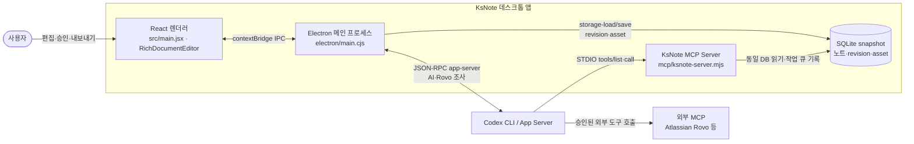
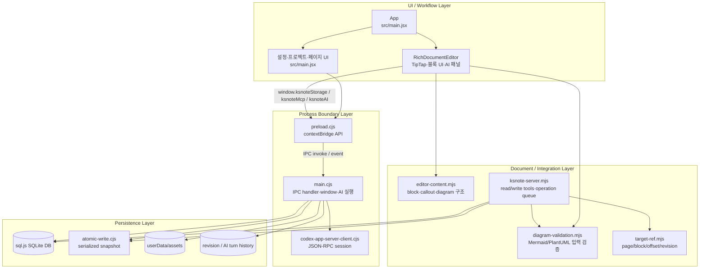
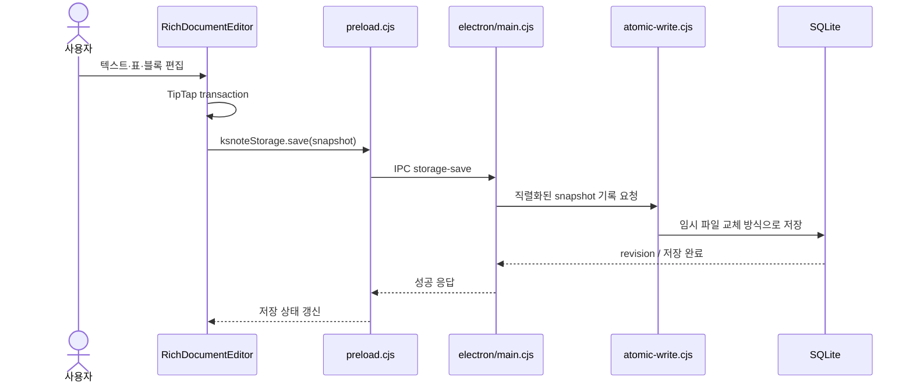
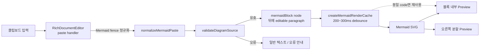
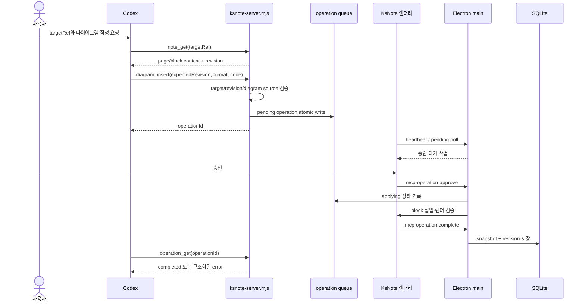

# KsNote 아키텍처 및 주요 동작 흐름

작성일: 2026-09-28

이 문서는 현재 저장소의 실제 진입점과 모듈 경계를 기준으로, 글로만 설명하기
어려운 구조와 실행 흐름을 Mermaid 다이어그램으로 정리한다. 다이어그램의 컴포넌트
이름은 소스의 주요 파일·심볼 이름을 유지했으며, 직접 호출 또는 IPC 계약이 확인된
관계만 실선으로 표현했다.

## 1. 시스템 컨텍스트

KsNote는 Electron 메인 프로세스, React/TipTap 렌더러, 로컬 SQLite 저장소, 선택적
Codex App Server와 STDIO MCP 서버로 구성된 로컬 우선 노트 앱이다.

근거:

- 렌더러 진입점은 `src/main.jsx:createRoot(...)`이고, 문서 편집은
  `src/RichDocumentEditor.jsx:RichDocumentEditor`가 담당한다.
- 메인 프로세스는 `electron/main.cjs`에서 `BrowserWindow`, `ipcMain`, SQLite
  snapshot, Codex App Server client를 소유한다.
- 렌더러에 노출되는 저장·AI·MCP API는 `electron/preload.cjs`의
  `contextBridge.exposeInMainWorld(...)`에 정의되어 있다.
- 외부 Codex가 사용하는 로컬 서버는 `mcp/ksnote-server.mjs`의
  `StdioServerTransport`다.

## 2. 내부 컴포넌트와 의존 방향

### 컴포넌트 책임

| 컴포넌트 | 책임 | 확인 위치 |
|---|---|---|
| `App` / `Settings` | 프로젝트·페이지 선택, 설정, 자동 저장 상태, 승인 UI | `src/main.jsx` |
| `RichDocumentEditor` | TipTap 문서 편집, Mermaid/PlantUML/draw.io 블록, AI 대상 범위 | `src/RichDocumentEditor.jsx` |
| `preload.cjs` | 렌더러와 메인 사이의 허용된 API만 노출 | `electron/preload.cjs` |
| `main.cjs` | IPC, SQLite 초기화, asset/revision 저장, AI 프로세스 수명 관리 | `electron/main.cjs` |
| `ksnote-server.mjs` | Codex용 읽기/쓰기 MCP tool, revision 충돌·작업 큐 | `mcp/ksnote-server.mjs` |
| `editor-content.mjs` / `diagram-validation.mjs` | 문서 블록 구조와 다이어그램 입력 검증 | `src/`, `mcp/` |

## 3. 일반 편집과 자동 저장 흐름

`electron/atomic-write.cjs:createSerializedFileWriter`가 동시 저장 요청을 직렬화하고,
`main.cjs`가 DB snapshot 및 revision 이력을 관리한다. 렌더러는 DB 파일을 직접 열지
않고 preload IPC만 사용한다.

## 4. Mermaid Smart Paste와 렌더링 흐름

핵심 구현은 `src/RichDocumentEditor.jsx`의 `normalizeMermaidPaste`,
`validateDiagramSource`, `sharedMermaidRenders`와 `src/mermaid-render-cache.mjs`다.
같은 Mermaid source는 code key로 pending/cached 결과를 공유하며, 붙여넣은 블록에는
커서가 이동할 수 있는 후행 문단을 함께 만든다.

## 5. Codex MCP 다이어그램 삽입 흐름

`targetRef`는 `mcp/target-ref.mjs`가 해석하며 `block/offset`을 우선 앵커로 사용하고,
`expectedRevision`이 현재 revision과 다르면 자동 덮어쓰기를 차단한다. 쓰기 tool은
`mcp/write-approval.mjs`의 승인 정책과 `mcp/ksnote-server.mjs`의 TTL 작업 큐를
통과해야 한다.

## 6. 관찰된 설계 특성

- **로컬 우선 저장**: UI와 MCP가 모두 동일한 SQLite와 asset 경로를 사용한다.
- **프로세스 경계 보안**: renderer는 Node/Electron API를 직접 호출하지 않고 preload가
  명시한 IPC만 사용한다.
- **명시적 타깃 편집**: 페이지·블록·offset·revision을 함께 전달해 현재 커서가
  바뀌어도 다른 위치에 쓰지 않도록 한다.
- **렌더링 결과 공유**: Mermaid source를 키로 편집 블록과 분할 프리뷰가 같은 SVG
  결과를 소비한다.
- **승인 가능한 쓰기**: MCP 쓰기는 pending → applying → completed/error/expired
  상태로 추적되고, 사용자 승인이 없으면 노트 DB에 반영되지 않는다.

## 7. 유지보수 시 주의점

1. `RichDocumentEditor`에서 selection 또는 revision을 새로 저장할 때는
   `targetRef`와 AI patch의 충돌 검사 경로를 함께 확인한다.
2. Mermaid 블록을 추가할 때는 source 정규화, 렌더 캐시, 후행 편집 문단, 분할
   프리뷰가 동일한 노드를 기준으로 동작하는지 확인한다.
3. IPC 채널을 추가하면 `preload.cjs`, `main.cjs`, 호출 UI의 세 지점을 함께 변경하고
   `tests/`의 source-regression 테스트를 추가한다.
4. MCP 쓰기 계약을 변경할 때는 `expectedRevision`, 승인, operation TTL, 완료 후
   SQLite 검증을 생략하지 않는다.
