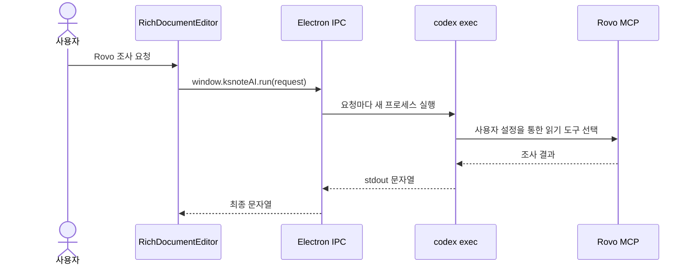
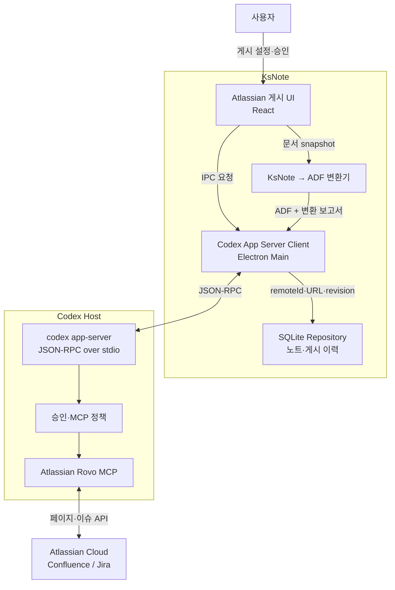
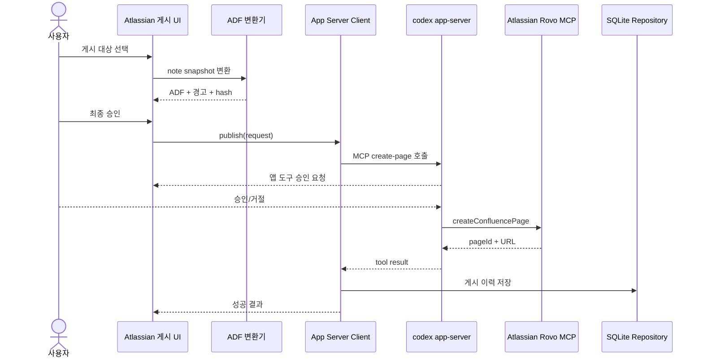

# KsNote × Codex App Server × Atlassian Rovo 게시 MVP 조사 및 적용 계획

작성일: 2026-07-29

## 1. 조사 결론

KsNote의 Atlassian 게시 기능은 **KsNote MCP Server만으로 구현되지 않는다.**
서로 반대 방향인 두 통합을 분리해야 한다.

1. `KsNote MCP Server`: Codex가 로컬 노트와 프로젝트를 읽고 수정한다.
2. `Codex App Server Client`: KsNote가 Codex에 연결하고, Codex 호스트에 설치된
   Atlassian Rovo MCP 도구를 조회·승인·호출한다.

이번 게시 MVP의 핵심은 2번이다. 현재 KsNote는 `codex exec`를 요청마다 실행하는
일회성 CLI 방식이므로, MCP 상태·OAuth·도구 스키마·승인 요청을 구조적으로 다룰 수
없다. 이를 Electron 메인 프로세스가 소유하는 장기 실행 `codex app-server`
JSON-RPC 세션으로 교체해야 한다.

## 2. 조사 근거

### 2.1 Codex 공식 동작

Codex App Server는 제품 내부 통합을 위한 JSON-RPC 2.0 인터페이스다. `stdio`,
WebSocket, Unix socket을 지원하며, 연결 직후 `initialize → initialized` 핸드셰이크가
필수다. KsNote는 로컬 Electron 앱이므로 MVP에서는 외부 포트를 열지 않는 `stdio`가
적합하다.

App Server가 제공하는 게시 MVP 관련 메서드는 다음과 같다.

- `account/read`: Codex 로그인 상태 확인
- `app/list`: 접근 가능한 앱/커넥터 확인
- `mcpServerStatus/list`: MCP 서버, 도구, 리소스, 인증 상태 확인
- `mcpServer/oauth/login`: OAuth 로그인 시작
- `config/mcpServer/reload`: MCP 설정 재로딩
- `mcpServer/tool/call`: 초기화된 MCP 서버의 도구 직접 호출
- `thread/start`, `turn/start`: 에이전트가 도구를 선택하는 작업 실행
- `turn/interrupt`: 진행 중 게시 취소
- `tool/requestUserInput`: 부작용이 있는 앱 도구의 승인 요청
- `mcpServer/elicitation/request`: MCP 서버가 요청하는 폼 또는 URL 인증 처리

Codex CLI, IDE, ChatGPT 데스크톱 앱은 같은 Codex 호스트의 MCP 설정을 공유한다.
따라서 Rovo를 각 앱에 다시 구현하는 것이 아니라, KsNote가 App Server를 통해
현재 Codex 호스트의 연결 상태와 도구를 사용해야 한다.

참고:

- [Codex App Server](https://learn.chatgpt.com/docs/app-server)
- [Codex Model Context Protocol](https://learn.chatgpt.com/docs/extend/mcp)
- [Codex 승인과 보안](https://learn.chatgpt.com/docs/agent-approvals-security)

### 2.2 현재 KsNote 구현

현재 구현은 다음 경로를 사용한다.



코드 근거:

- `electron/preload.cjs`: `ksnoteAI.run`, `cancel`, `onChunk`만 렌더러에 노출한다.
- `electron/main.cjs:219`의 `runCli`: 요청마다 자식 프로세스를 생성한다.
- `electron/main.cjs:265`의 `ai-run`: 조사 모드에서만 사용자 Codex 설정을
  허용하고 `codex exec --ephemeral --sandbox read-only`를 실행한다.
- `src/RichDocumentEditor.jsx`의 `askAI`: stdout을 AI 응답 문자열로 처리한다.

이 방식은 읽기 전용 조사에는 사용할 수 있지만 다음 정보가 없다.

- Rovo 설치·활성·OAuth 상태의 구조화된 진단
- 실제 도구 목록과 입력 JSON Schema
- 앱 도구 승인 요청/응답
- 페이지 생성 결과의 안정적인 `pageId`, URL, 오류 코드
- 장기 실행 작업과 세션 재개

### 2.3 현재 Rovo 도구 스키마

현재 Codex 환경에서 확인된 Atlassian Rovo 도구는 다음 기능을 제공한다.

- Confluence 페이지 조회
- Confluence 페이지 생성
- Confluence 페이지 업데이트
- Markdown 또는 ADF 본문 입력
- Confluence 공간·페이지 계층 조회
- Jira/Confluence 통합 검색
- Jira 이슈 조회·수정·댓글·전환 계열 작업

Confluence 생성 도구의 핵심 입력은 `cloudId`, `spaceId`, `title`, `body`,
`contentFormat(markdown|adf)`, 선택적 `parentId`다. 업데이트 도구는 `pageId`와
동일한 본문 형식을 사용한다.

반면 이번 조사에서 **로컬 이미지 바이너리를 Confluence attachment로 업로드하는
Rovo 도구는 확인되지 않았다.** 댓글 도구는 기존 `attachmentId`를 참조할 수 있지만,
그 ID를 새로 만드는 업로드 도구는 노출되지 않았다. 따라서 이미지 업로드를 1차
MVP 완료 조건으로 두면 검증되지 않은 별도 인증/API 구현이 필요해진다.

### 2.4 Atlassian 문서 표현

Atlassian Document Format(ADF)은 Jira 설명·댓글과 Atlassian 리치 텍스트에서
사용되는 JSON 문서 구조다. `table`, `tableRow`, `tableCell`, `tableHeader`,
`mediaSingle` 등의 노드를 제공한다.

표 너비는 다음처럼 매핑할 수 있다.

- `table.attrs.width`: 표 전체 너비(px)
- `table.attrs.displayMode`: 반응형 축소 또는 고정 폭
- `tableCell.attrs.colwidth`: 열 또는 병합된 열의 픽셀 너비 배열
- `tableCell.attrs.colspan`, `rowspan`: 병합 셀

단, Jira에서는 표가 텍스트 컨테이너 전체 폭으로 자동 표시되므로 Confluence와
동일한 시각적 폭을 보장할 수 없다.

참고:

- [Atlassian Document Format](https://developer.atlassian.com/cloud/jira/platform/apis/document/structure/)
- [ADF table](https://developer.atlassian.com/cloud/jira/platform/apis/document/nodes/table/)
- [ADF tableCell](https://developer.atlassian.com/cloud/jira/platform/apis/document/nodes/table_cell/)
- [ADF mediaSingle](https://developer.atlassian.com/cloud/jira/platform/apis/document/nodes/mediaSingle/)

## 3. 목표 아키텍처



### 컴포넌트 책임

| 컴포넌트 | 책임 |
|---|---|
| Atlassian 게시 UI | 대상 선택, 변환 미리보기, 경고, 최종 승인 |
| KsNote → ADF 변환기 | TipTap JSON/HTML을 결정적 ADF로 변환 |
| Codex App Server Client | 프로세스 생명주기, JSON-RPC, 이벤트, OAuth, 취소 |
| 승인·MCP 정책 | 쓰기 도구 승인과 Rovo 도구 allowlist |
| SQLite Repository | 원격 pageId, URL, 게시 revision, content hash, 감사 로그 |

## 4. MVP 범위 결정

### 포함

- App Server `stdio` 연결과 재시작
- Codex 계정 및 Rovo 연결 상태 진단
- Rovo 도구 런타임 discovery와 JSON Schema 캐시
- Confluence 공간·상위 페이지 선택
- 현재 노트 전체를 새 Confluence 페이지로 생성
- 제목, 문단, 제목 계층, 목록, 인용, 링크, 코드 블록
- 표, 헤더, 병합 셀, 배경색, 열 너비 변환
- 게시 전 ADF/변환 결과 미리보기
- 사용자 승인 + Codex 앱 도구 승인 처리
- 성공 시 `cloudId`, `pageId`, URL, note revision, hash 저장
- 취소, 로그인 만료, 권한 거부, schema 불일치 오류 표시

### 제외

- 기존 페이지 덮어쓰기
- Jira 이슈 생성·수정
- 양방향 동기화
- Atlassian 변경사항 자동 병합
- 로컬 이미지 바이너리 업로드
- 여러 노트 일괄 게시
- 백그라운드 자동 게시

이미지는 첫 MVP에서 다음 정책을 사용한다.

- 공개 HTTPS URL 이미지는 Markdown/ADF 참조를 시도하고 미리보기에서 경고한다.
- 로컬 파일, `file:`, Data URL 이미지는 게시에서 제외하고 누락 보고서에 표시한다.
- Rovo attachment 업로드 도구가 이후 확인되면 별도 증분으로 추가한다.

## 5. 적용 계획

### Gate 0 — 설치된 Codex 버전의 계약 고정

구현 전에 다음을 실행해 현재 설치 버전과 정확히 일치하는 App Server TypeScript
Schema를 생성한다.

```powershell
codex app-server generate-ts --out electron/codex-app-server-schema
codex app-server generate-json-schema --out electron/codex-app-server-schema
```

완료 조건:

- `initialize`, `mcpServerStatus/list`, `mcpServer/tool/call` 요청/응답 확인
- Rovo 서버명과 create-page 도구명을 런타임에서 식별
- 쓰기 호출 시 발생하는 승인 이벤트를 테스트 사이트에서 캡처
- 도구명이 해시 또는 버전에 따라 달라져도 description/schema로 매핑 가능

### Slice 1 — App Server 기반 연결 진단

추가 파일:

```text
electron/codex-app-server-client.cjs
electron/atlassian-rovo-service.cjs
```

추가 IPC:

```text
atlassian-status
atlassian-login
atlassian-list-spaces
atlassian-list-pages
atlassian-cancel
```

완료 조건:

- KsNote에서 Codex 로그인, Rovo 설치, OAuth 만료, 접근 거부를 구분한다.
- 앱 종료 시 App Server 자식 프로세스를 종료한다.
- 비정상 종료 시 한 번 재시작하고 진행 중 요청은 실패 처리한다.

### Slice 2 — 결정적 ADF 변환기

AI 프롬프트로 HTML을 변환하지 않는다. TipTap 문서 구조를 순회하는 순수 함수로
ADF를 생성한다.

```text
src/atlassian/export-adf.js
src/atlassian/export-adf.test.js
```

표 변환 규칙:

1. KsNote 각 열의 px 폭을 읽는다.
2. 누락된 폭은 균등 분배한다.
3. 전체 폭을 144~1800px 범위로 제한한다.
4. 셀 `colwidth` 배열과 `colspan`, `rowspan`을 생성한다.
5. Jira 대상에서는 폭 보존 불가 경고를 반환한다.

변환 결과:

```json
{
  "document": { "version": 1, "type": "doc", "content": [] },
  "warnings": [],
  "omittedAssets": [],
  "sourceRevision": 18,
  "contentHash": "sha256:..."
}
```

### Slice 3 — 게시 미리보기와 승인

UI 상태:

```text
idle → checking → selecting → previewing → awaitingApproval
     → publishing → succeeded | failed | cancelled
```

사용자가 확인할 항목:

- Atlassian 사이트, 공간, 상위 페이지
- 생성될 제목
- 전송되는 노트 범위와 revision
- 변환 경고와 제외 이미지
- 실제 사용될 Rovo 쓰기 도구

### Slice 4 — Confluence 새 페이지 생성

게시 순서:



MVP에서는 생성만 허용한다. 같은 note revision과 content hash로 재요청된 경우
idempotency key를 확인해 중복 페이지 생성을 경고한다.

### Slice 5 — 검증과 릴리스

필수 테스트:

- 문단/제목/목록/인용/코드 ADF snapshot
- 1×1, 다열, 병합 셀, 열 너비 표 snapshot
- 로컬 이미지 제외 경고
- Rovo 미설치, OAuth 만료, 공간 권한 없음
- 승인 거절, 사용자 취소, App Server 비정상 종료
- 동일 revision 중복 게시 방지
- 성공 결과의 pageId/URL/게시 revision 저장

## 6. 데이터 모델

SQLite 추가 테이블 초안:

```sql
CREATE TABLE external_publications (
  id INTEGER PRIMARY KEY AUTOINCREMENT,
  note_id TEXT NOT NULL,
  provider TEXT NOT NULL,
  cloud_id TEXT NOT NULL,
  remote_type TEXT NOT NULL,
  remote_id TEXT NOT NULL,
  remote_url TEXT,
  source_revision INTEGER NOT NULL,
  content_hash TEXT NOT NULL,
  status TEXT NOT NULL,
  request_id TEXT NOT NULL,
  created_at INTEGER NOT NULL
);
```

`status`는 `pending`, `succeeded`, `failed`, `cancelled`만 허용한다. 게시 실패도
감사 목적으로 남기되 원격 ID가 없는 실패 행은 재시도와 연결한다.

## 7. MVP 완료 기준

- [ ] KsNote가 `codex app-server`와 초기화·종료를 안정적으로 수행한다.
- [ ] Codex 로그인과 Rovo OAuth 상태를 구조화된 값으로 표시한다.
- [ ] 도구명을 하드코딩하지 않고 런타임 schema에서 Confluence 생성 도구를 찾는다.
- [ ] 현재 노트를 유효한 ADF로 변환하고 schema 검증한다.
- [ ] 표의 구조·병합·열 너비가 Confluence에서 허용 범위 내 유지된다.
- [ ] 지원하지 않는 이미지가 게시 전에 명확히 표시된다.
- [ ] 사용자가 대상·본문·경고를 확인한 뒤에만 쓰기 호출이 시작된다.
- [ ] Codex/App MCP 승인 요청을 KsNote UI에서 승인 또는 거절할 수 있다.
- [ ] 성공한 페이지의 ID, URL, source revision, hash가 SQLite에 저장된다.
- [ ] 취소·거절·로그인 만료·권한 부족이 서로 다른 오류로 표시된다.
- [ ] 일반 AI 질문과 Rovo 조사 모드는 계속 외부 쓰기가 불가능하다.

## 8. 후속 증분

1. 기존 Confluence 페이지 업데이트와 원격 version 충돌 검사
2. Rovo attachment 도구 제공 여부 재확인
3. 별도 인증이 합의된 경우에만 Confluence REST attachment adapter 추가
4. Jira 이슈 설명·댓글 게시
5. KsNote MCP Server와 결합해 “이 노트를 Jira/Confluence로 보내기”를 Codex에서도 실행
6. 원격 변경 가져오기와 3-way merge

