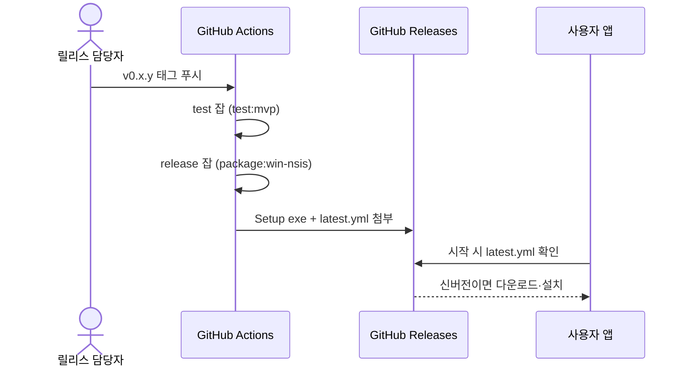

# KsNote 배포 가이드

두 산출물은 독립적으로 배포한다: **데스크톱 앱**(Electron)과 **MCP 서버**(Node).

## 0. 릴리스 흐름 (F-REL-01)

시나리오 `UC-REL-01` (정기 릴리스 내보내기): 담당자가 버전 범프 후 `v0.x.y`
태그를 푸시하면, CI가 테스트→NSIS 빌드→Releases 업로드를 자동 수행한다.
사용자는 다음 앱 시작 때 업데이트를 받는다. 수동 개입은 태그 푸시 한 번뿐이다.



| 단계 | 흐름 | 코드·설정 | 설명 |
|---|---|---|---|
| S1 | 버전 범프 + 태그 푸시 | `package.json` (`version`), `git tag v0.x.y` | `package-lock.json`도 함께 갱신된다 (`npm version patch`). 태그 형식은 `v*`로 고정 (워크플로 트리거) |
| S2 | test 잡 | `.github/workflows/release.yml` (`test`), `npm run test:mvp` | 185개 회귀가 전부 통과해야 다음 잡으로 간다. 실패하면 릴리스 중단 |
| S3 | release 잡 | `.github/workflows/release.yml` (`release`, `needs: test`), `GH_TOKEN = secrets.GITHUB_TOKEN` | 토큰은 GitHub가 자동 주입한다. 별도 발급 불필요. `windows-latest` runner에서 15~25분 소요 |
| S4 | Releases 첨부 | `package.json` (`build.publish.provider=github`, `artifactName`) | Setup exe + `latest.yml` + blockmap이 해당 태그에 붙는다. 서명 인증서가 없어 SmartScreen 경고는 남는다 |
| S5 | 시작 시 확인·설치 | `electron/main.cjs` (`app.isPackaged` 가드 안 `checkForUpdatesAndNotify`) | 바뀐 조각만 내려받아 덮어쓴다. 노트·설정(userData)은 건드리지 않는다 |

읽을 때 포인트: S1(사람)→S2~S4(CI)→S5(앱 자동)의 분업이 핵심이다. 로컬에는
`release/` 산출물이 남지 않아도 된다 (gitignore). 문제 생기면 Actions 로그가
진실의 원천이다.

## 1. 데스크톱 앱 (Windows)

| 산출물 | 용도 | 자동 업데이트 |
|---|---|---|
| NSIS (`-Setup-*.exe`) | 일반 설치 (사용자별, 관리자 불필요) | O (`electron-updater`, GitHub Releases) |
| Portable / dir | 무설치·테스트용 | X |

```powershell
npm run build
npm run package:win-nsis   # NSIS 설치 파일 (release/)
npm run package:win        # 무설치 dir (로컬 테스트용)
```

릴리스:
1. `package.json` version 증가 후 태그 푸시 (`v0.x.y`).
2. CI에서 `GH_TOKEN` 환경 변수와 함께 `package:win-nsis` 실행.
   `publish.provider=github` 설정이 `latest.yml`과 설치 파일을 Releases에 업로드한다.
3. 앱 시작 시 패키지 빌드에서만 업데이트를 확인하고 설치한다.

## 2. MCP 서버 — 로컬 STDIO (기본)

에이전트와 같은 머신에서 실행한다. DB 파일을 직접 읽으므로 별도 데몬이 필요 없다.

```bash
# Codex
codex mcp add ksnote --env KSNOTE_DB_PATH=/path/to/ksnote.db -- node /path/to/note/mcp/ksnote-server.mjs

# Claude Desktop (claude_desktop_config.json)
{
  "mcpServers": {
    "ksnote": {
      "command": "node",
      "args": ["/path/to/note/mcp/ksnote-server.mjs"],
      "env": { "KSNOTE_DB_PATH": "/path/to/ksnote.db" }
    }
  }
}
```

## 3. MCP 서버 — 원격 Streamable HTTP

원격 에이전트가 쓸 때 사용한다. 전송 규격은 MCP 표준 Streamable HTTP
(`POST /mcp`, `Accept: application/json, text/event-stream`), 상태 확인은
`GET /health`다.

환경 변수:

| 변수 | 기본값 | 설명 |
|---|---|---|
| `KSNOTE_MCP_TRANSPORT` | `stdio` | `http`로 설정 시 HTTP 모드 |
| `KSNOTE_MCP_HOST` | `127.0.0.1` | 컨테이너 안에서는 `0.0.0.0` |
| `KSNOTE_MCP_PORT` | `3000` | 리슨 포트 |
| `KSNOTE_MCP_TOKEN` | (없음) | 설정 시 `Authorization: Bearer` 필수. loopback 외 리슨에서 미설정 시 경고 |
| `KSNOTE_MCP_ALLOWED_HOSTS` | (없음) | `Host`/`Origin` 허용 목록 (DNS rebinding 방어) |
| `KSNOTE_DB_PATH` | 자동 탐색 | SQLite 경로. 컨테이너에서는 볼륨 경로(`/data/ksnote.db`) |

### Docker Compose (권장)

```bash
KSNOTE_MCP_TOKEN=$(openssl rand -hex 16) docker compose -f docker-compose.mcp.yml up -d --build
curl http://127.0.0.1:3000/health
```

SQLite는 `ksnote-data` 볼륨에 유지된다. 컨테이너를 지워도 데이터는 남는다.

### VPS + nginx (직접 운영 시)

1. 위 compose로 `127.0.0.1:3000`에만 바인딩한다 (외부 직접 노출 금지).
2. nginx에서 TLS 종료 후 프록시. 스트리밍이 끊기지 않게 필수:

```nginx
location /mcp {
    proxy_pass http://127.0.0.1:3000;
    proxy_http_version 1.1;
    proxy_buffering off;
    proxy_read_timeout 300s;
    proxy_set_header Host $host;
}
```

3. 클라이언트는 `https://notes.example.com/mcp` + Bearer 헤더로 접속
   (형식은 `AGENTS.md` 참고).

### PaaS (Railway / Fly.io / Render)

같은 이미지 + 환경 변수(`KSNOTE_MCP_TOKEN`, 볼륨 마운트)만 넘기면 된다.
TLS는 플랫폼이 처리하므로 nginx 단계는 생략한다. SQLite 볼륨이 없는
플랫폼에서는 영속 디스크 옵션을 켠다.

## 4. 원격 승인 플로우 주의

쓰기 도구는 KsNote 앱의 승인이 필요하다. 원격 서버 단독으로는
`awaiting_approval`까지만 진행되고, 같은 DB 볼륨을 보는 KsNote 앱(또는
승인 담당 프로세스)이 있어야 `completed`가 된다. 무인 자동화가 필요하면
별도 승인 정책을 문서화한 뒤 구현한다 (현재 미지원).

## 5. 보안 체크리스트

- 토큰은 환경 변수·시크릿 매니저로만 전달하고 이미지에 굽지 않는다.
- `KSNOTE_MCP_ALLOWED_HOSTS`에 실제 호스트를 등록한다.
- 평면 HTTP는 loopback·사설망까지만 허용하고 외부에는 항상 HTTPS를 둔다.
